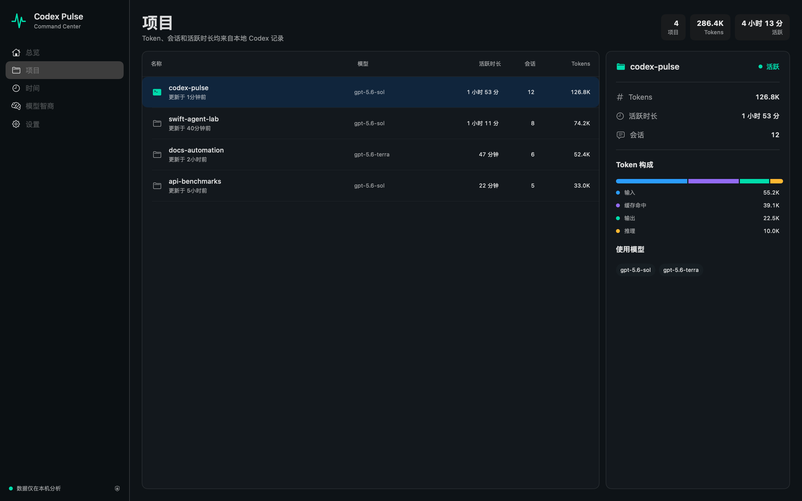
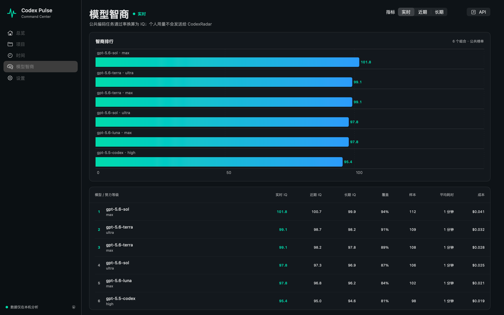

# Codex Pulse

## 功能

- 实时统计 Codex 的 Token、会话、活跃任务与使用时长。
- 按项目汇总输入、缓存命中、输出和推理 Token，并展示模型分布。
- 提供今天、7 天和 30 天趋势，以及按小时、按天的时间分析。
- 通过本机 `codex app-server` 展示账户额度、剩余比例和重置时间。
- 读取 CodexRadar 公共榜单，展示模型实时、近期和长期 IQ、覆盖率、样本量、耗时与成本。
- 提供原生 macOS 菜单栏速览、手动刷新和独立设置页。

## 安全性

- 本地数据只在 Mac 上分析；数据库以只读方式打开，统计缓存保存在用户的 Application Support 目录。
- 不解析、保存或展示提示词、回复正文、会话预览与账户身份信息，也不会访问 `~/.codex/auth.json`。
- 账户额度只通过本机 Codex 官方客户端协议读取，不复制或记录登录凭据。
- 唯一的外部请求是获取 CodexRadar 公共榜单；本地项目、Token 和账户用量不会上传。
- CodexRadar 请求使用临时、无 URL 缓存的网络会话；服务不可用时只保留最后一次成功的公开榜单快照。

## 界面截图

### 项目使用情况

### 模型智商

